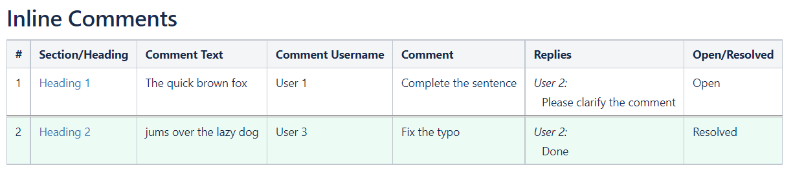

# Confluence Inline Comments Extractor

## About

Getting a list of inline comments and the replies in confluence pages is a tedious and manual process. This repo offers multiple bookmarklets that execute javascript on your browser to extract the comments and give you the list at the end of the page.

### Notes

  1. This script was developed and tested only on Chrome browser. It may or may not work on other browsers.

  2. The list of comments is added only at your browser's end and it does not update in the confluence page itself. So refreshing the page clears this list.

  3. Only inline comments are processed by these bookmarklets. The regular comments that are added at the bottom of the page are excluded.

## Installation

1. Ensure that you have **Bookmarks bar** enabled in your browser and is visible. On Chrome `Ctrl + Shift + B` will toggle the visibility of the bookmarks bar.

2. Go to the [Bookmarklets](#bookmarklets) section and choose which bookmarklet you need. Then **drag & drop** the corresponding link to your bookmarks bar.

## Bookmarklets

1. <a id="thelink" href="javascript: (function() {var a = document.querySelectorAll(&quot;.inline-comment-marker.valid, .comment-count-overlay&quot;);const output_xpath = '//*[@id=&quot;main&quot;]';const resolved_comments_view_btn_xpath = '//*[@id=&quot;view-resolved-comments&quot;]';const resolved_comments_close_btn_xpath = '//*[@id=&quot;resolved-dialog-close-button&quot;]';var i = 0;var output_div = document.createElement('div');var heading_span = document.createElement('span');heading_span.innerHTML = &quot;<h1>Inline Comments</h1>&quot;;output_div.appendChild(heading_span);if (a.length <= 0) {alert(&quot;No confluence comments found in this page...&quot;);return;}function process_resolved_comments(output_div) {document.evaluate(resolved_comments_view_btn_xpath, document).iterateNext().click();setTimeout(function() {const resolved_comments_div_xpath = '//*[@id=&quot;ic-resolved-comment-dialog&quot;]/div/div[2]';const resolved_comments_username_xpath = '//*[@id=&quot;ic-resolved-comment-dialog&quot;]/div/div[2]/div[i]/div[1]/div[1]/a[2]';const resolved_comments_text_xpath = '//*[@id=&quot;ic-resolved-comment-dialog&quot;]/div/div[2]/div[i]/div[1]/div[2]/div/blockquote';const resolved_comments_comment_xpath = '//*[@id=&quot;ic-resolved-comment-dialog&quot;]/div/div[2]/div[i]/div[1]/div[2]/div/p';const resolved_comments_link_xpath = '//*[@id=&quot;ic-resolved-comment-dialog&quot;]/div/div[2]/div[i]/div[1]/div[3]/ul';const resolved_comments_reply_div_xpath = '//*[@id=&quot;ic-resolved-comment-dialog&quot;]/div/div[2]/div[i]/div[2]';const resolved_comments_reply_username_xpath = '//*[@id=&quot;ic-resolved-comment-dialog&quot;]/div/div[2]/div[i]/div[2]/div[j]/div[1]/a[2]';const resolved_comments_reply_text_xpath = '//*[@id=&quot;ic-resolved-comment-dialog&quot;]/div/div[2]/div[i]/div[2]/div[j]/div[2]/div';var resolved_comments_div = document.evaluate(resolved_comments_div_xpath, document).iterateNext();var resolved_comments_count = resolved_comments_div.children.length;var comment_count = i;for (i = 1; i <= resolved_comments_count; i++) {var username = document.evaluate(resolved_comments_username_xpath.replace(/\[i\]/g, &quot;[&quot; + i + &quot;]&quot;), document).iterateNext().textContent;var comment_text = document.evaluate(resolved_comments_text_xpath.replace(/\[i\]/g, &quot;[&quot; + i + &quot;]&quot;), document).iterateNext().outerHTML;var comment = document.evaluate(resolved_comments_comment_xpath.replace(/\[i\]/g, &quot;[&quot; + i + &quot;]&quot;), document).iterateNext().innerHTML;var comment_link = document.evaluate(resolved_comments_link_xpath.replace(/\[i\]/g, &quot;[&quot; + i + &quot;]&quot;), document).iterateNext().lastElementChild.lastElementChild.getElementsByTagName(&quot;a&quot;)[0].href;var comment_div = document.createElement('div');comment_div.setAttribute('class', 'confluence-information-macro confluence-information-macro-information conf-macro output-block');comment_div.setAttribute('style', 'background-color:#ecfbf3;');comment_div.setAttribute('data-hasbody', 'true');comment_div_content = '
' + 'Comment #' + (comment_count + 1) + ': Resolved
';comment_div_content += '
';comment_div_content += '
' + comment_text + '';comment_div_content += '
<a style=&quot;cursor: pointer;&quot; onclick=&quot;window.open(\'' + comment_link + '\');&quot;>Click here to view this comment</a>

';comment_div_content += '

' + username + ':
';comment_div_content += '
' + comment + '

';var reply_count = 0;var reply_count_div = document.evaluate(resolved_comments_reply_div_xpath.replace(/\[i\]/g, &quot;[&quot; + i + &quot;]&quot;), document).iterateNext();if (reply_count_div && reply_count_div.children) {reply_count = reply_count_div.children.length;}if (reply_count > 1) {comment_div_content += '

Replies:

';for (let j = 1; j <= reply_count; j++) {var reply_username = document.evaluate(resolved_comments_reply_username_xpath.replace(/\[i\]/g, &quot;[&quot; + i + &quot;]&quot;).replace(/\[j\]/g, &quot;[&quot; + j + &quot;]&quot;), document).iterateNext().textContent;var reply_comment = document.evaluate(resolved_comments_reply_text_xpath.replace(/\[i\]/g, &quot;[&quot; + i + &quot;]&quot;).replace(/\[j\]/g, &quot;[&quot; + j + &quot;]&quot;), document).iterateNext().innerHTML;if (j < reply_count) {comment_div_content += '

' + reply_username + ':
';} else {comment_div_content += '

' + reply_username + ':
';}comment_div_content += '
' + reply_comment + '

';}} else if (reply_count == 1) {comment_div_content += '

Replies:

';var reply_username = document.evaluate(resolved_comments_reply_username_xpath.replace(/\[i\]/g, &quot;[&quot; + i + &quot;]&quot;).replace(/\[j\]/g, &quot;&quot;), document).iterateNext().textContent;var reply_comment = document.evaluate(resolved_comments_reply_text_xpath.replace(/\[i\]/g, &quot;[&quot; + i + &quot;]&quot;).replace(/\[j\]/g, &quot;&quot;), document).iterateNext().innerHTML;comment_div_content += '

' + reply_username + ':
';comment_div_content += '
' + reply_comment + '

';}comment_div_content += '
';comment_div.innerHTML = comment_div_content;output_div.appendChild(comment_div);comment_count++;}document.evaluate(resolved_comments_close_btn_xpath, document).iterateNext().click();var output_div_elem = document.evaluate(output_xpath, document).iterateNext();output_div_elem.appendChild(output_div);document.body.style.cursor = 'default';alert(&quot;Processed all inline comments !\n\nThe comments list has been added at the end of the page !!&quot;);window.location.href = '#comments-section';}, 1000);}function process_open_comments(output_div) {a[i].click();setTimeout(function() {const username_xpath = '//*[@id=&quot;content&quot;]/div[9]/div/div[1]/div[3]/div[1]/a[2]';const comment_xpath = '//*[@id=&quot;content&quot;]/div[9]/div/div[1]/div[3]/div[2]/div';const reply_container_xpath = '//*[@id=&quot;content&quot;]/div[9]/div/div[2]/div';const reply_username_xpath = '//*[@id=&quot;content&quot;]/div[9]/div/div[2]/div/div[x]/div[1]/a[2]';const reply_comment_xpath = '//*[@id=&quot;content&quot;]/div[9]/div/div[2]/div/div[x]/div[2]/div';var username = document.evaluate(username_xpath, document).iterateNext().textContent;var comment = document.evaluate(comment_xpath, document).iterateNext().innerHTML;var comment_div = document.createElement('div');comment_div.setAttribute('class', 'confluence-information-macro confluence-information-macro-information conf-macro output-block');comment_div.setAttribute('data-hasbody', 'true');var exit = false;var elem = a[i];var text = &quot;&quot;;do {if (elem.previousElementSibling) {text += elem.previousElementSibling.tagName + &quot; > &quot;;if (elem.previousElementSibling.tagName.toUpperCase().startsWith(&quot;H&quot;)) {elem = elem.previousElementSibling;exit = true;} else {elem = elem.previousElementSibling;}} else {elem = elem.parentElement;}} while (!exit);comment_div_content = '
' + 'Comment #' + (i + 1) + ': Open
';comment_div_content += '
';comment_div_content += '
' + a[i].outerHTML + '';comment_div_content += '
Section: <a href=&quot;#' + elem.id + '&quot;>' + elem.innerHTML + '</a>

';comment_div_content += '

' + username + ':
';comment_div_content += '
' + comment + '

';var replies = document.evaluate(reply_container_xpath, document).iterateNext().children.length;if (replies > 1) {comment_div_content += '

Replies:

';for (let j = 1; j <= replies; j++) {var reply_username = document.evaluate(reply_username_xpath.replace(&quot;[x]&quot;, &quot;[&quot; + j + &quot;]&quot;), document).iterateNext().textContent;var reply_comment = document.evaluate(reply_comment_xpath.replace(&quot;[x]&quot;, &quot;[&quot; + j + &quot;]&quot;), document).iterateNext().innerHTML;if (j < replies) {comment_div_content += '

' + reply_username + ':
';} else {comment_div_content += '

' + reply_username + ':
';}comment_div_content += '
' + reply_comment + '

';}} else if (replies == 1) {comment_div_content += '

Replies:

';var reply_username = document.evaluate(reply_username_xpath.replace(&quot;[x]&quot;, &quot;[&quot; + 1 + &quot;]&quot;), document).iterateNext().textContent;var reply_comment = document.evaluate(reply_comment_xpath.replace(&quot;[x]&quot;, &quot;[&quot; + 1 + &quot;]&quot;), document).iterateNext().innerHTML;comment_div_content += '

' + reply_username + ':
';comment_div_content += '
' + reply_comment + '

';}comment_div_content += '
';comment_div.innerHTML = comment_div_content;output_div.appendChild(comment_div);i++;if (i < a.length) {setTimeout(process_open_comments, 500, output_div);} else {try {process_resolved_comments(output_div);} catch (e) {document.body.style.cursor = 'default';console.error(e);document.evaluate(resolved_comments_close_btn_xpath, document).iterateNext().click();alert(&quot;Processing failed !!!\n\n Please check browser's console for details...&quot;);}}}, 500);}try {document.body.style.cursor = 'progress';process_open_comments(output_div);} catch (e) {document.body.style.cursor = 'default';console.error(e);alert(&quot;Processing failed !!!\n\n Please check browser's console for details...&quot;);}})()">Confluence Comments - List</a>

   This produces a list of comments and their replies as shown in the image below.

   ### Figure 1. Confluence Comments - List View

   

2. <a id="thelink" href="javascript: (function() {var a = document.querySelectorAll(&quot;.inline-comment-marker.valid, .comment-count-overlay&quot;);const output_xpath = '//*[@id=&quot;main&quot;]';const resolved_comments_view_btn_xpath = '//*[@id=&quot;view-resolved-comments&quot;]';const resolved_comments_close_btn_xpath = '//*[@id=&quot;resolved-dialog-close-button&quot;]';var i = 0;var output_div = document.createElement('div');var heading_span = document.createElement('span');var columns = [&quot;#&quot;, &quot;Section/Heading&quot;, &quot;Comment Text&quot;, &quot;Comment Username&quot;, &quot;Comment&quot;, &quot;Replies&quot;, &quot;Open/Resolved&quot;];var table_div_content = &quot;&quot;;heading_span.innerHTML = &quot;<h1>Inline Comments</h1>&quot;;output_div.appendChild(heading_span);var table_div = document.createElement('div');table_div.setAttribute('class', 'table-wrap');table_div_content = '<table class=&quot;relative-table wrapped confluenceTable ite-marked-table ite-real-table tablesorter tablesorter-default custom-ite-table stickyTableHeaders&quot; style=&quot;padding: 0px;&quot; role=&quot;grid&quot;><thead class=&quot;tableFloatingHeaderOriginal&quot;><tr ite-row-number=&quot;0&quot; role=&quot;row&quot; class=&quot;tablesorter-headerRow&quot;>';for (var j = 0; j < columns.length; j++) {table_div_content += '<th style=&quot;text-align: left;&quot; colspan=&quot;1&quot; class=&quot;confluenceTh tablesorter-header sortableHeader tablesorter-headerUnSorted custom-row&quot; ite-col-number=&quot;[i]&quot; data-column=&quot;[i]&quot; tabindex=&quot;0&quot; scope=&quot;col&quot; role=&quot;columnheader&quot; aria-disabled=&quot;false&quot; unselectable=&quot;off&quot; aria-sort=&quot;none&quot;>
'.replace(/\[i\]/g, &quot;[&quot; + j + &quot;]&quot;);table_div_content += columns[j] + '
</th>';}table_div_content += '</tr></thead><tbody aria-live=&quot;polite&quot; aria-relevant=&quot;all&quot; class=&quot;ui-sortable&quot;>';if (a.length <= 0) {alert(&quot;No confluence comments found in this page...&quot;);return;}function process_resolved_comments(output_div, table_div, table_div_content) {document.evaluate(resolved_comments_view_btn_xpath, document).iterateNext().click();setTimeout(function() {const resolved_comments_div_xpath = '//*[@id=&quot;ic-resolved-comment-dialog&quot;]/div/div[2]';const resolved_comments_username_xpath = '//*[@id=&quot;ic-resolved-comment-dialog&quot;]/div/div[2]/div[i]/div[1]/div[1]/a[2]';const resolved_comments_text_xpath = '//*[@id=&quot;ic-resolved-comment-dialog&quot;]/div/div[2]/div[i]/div[1]/div[2]/div/blockquote';const resolved_comments_comment_xpath = '//*[@id=&quot;ic-resolved-comment-dialog&quot;]/div/div[2]/div[i]/div[1]/div[2]/div/p';const resolved_comments_link_xpath = '//*[@id=&quot;ic-resolved-comment-dialog&quot;]/div/div[2]/div[i]/div[1]/div[3]/ul';const resolved_comments_reply_div_xpath = '//*[@id=&quot;ic-resolved-comment-dialog&quot;]/div/div[2]/div[i]/div[2]';const resolved_comments_reply_username_xpath = '//*[@id=&quot;ic-resolved-comment-dialog&quot;]/div/div[2]/div[i]/div[2]/div[j]/div[1]/a[2]';const resolved_comments_reply_text_xpath = '//*[@id=&quot;ic-resolved-comment-dialog&quot;]/div/div[2]/div[i]/div[2]/div[j]/div[2]/div';var resolved_comments_div = document.evaluate(resolved_comments_div_xpath, document).iterateNext();var resolved_comments_count = resolved_comments_div.children.length;var comment_count = i;for (i = 1; i <= resolved_comments_count; i++) {var username = document.evaluate(resolved_comments_username_xpath.replace(/\[i\]/g, &quot;[&quot; + i + &quot;]&quot;), document).iterateNext().textContent;var comment_text = document.evaluate(resolved_comments_text_xpath.replace(/\[i\]/g, &quot;[&quot; + i + &quot;]&quot;), document).iterateNext().innerHTML;var comment = document.evaluate(resolved_comments_comment_xpath.replace(/\[i\]/g, &quot;[&quot; + i + &quot;]&quot;), document).iterateNext().innerHTML;var comment_link = document.evaluate(resolved_comments_link_xpath.replace(/\[i\]/g, &quot;[&quot; + i + &quot;]&quot;), document).iterateNext().lastElementChild.lastElementChild.getElementsByTagName(&quot;a&quot;)[0].href;var reply_count = 0;var reply_count_div = document.evaluate(resolved_comments_reply_div_xpath.replace(/\[i\]/g, &quot;[&quot; + i + &quot;]&quot;), document).iterateNext();if (reply_count_div && reply_count_div.children) {reply_count = reply_count_div.children.length;}var reply_content = &quot;&quot;;if (reply_count > 1) {for (let j = 1; j <= reply_count; j++) {var reply_username = document.evaluate(resolved_comments_reply_username_xpath.replace(/\[i\]/g, &quot;[&quot; + i + &quot;]&quot;).replace(/\[j\]/g, &quot;[&quot; + j + &quot;]&quot;), document).iterateNext().textContent;var reply_comment = document.evaluate(resolved_comments_reply_text_xpath.replace(/\[i\]/g, &quot;[&quot; + i + &quot;]&quot;).replace(/\[j\]/g, &quot;[&quot; + j + &quot;]&quot;), document).iterateNext().innerHTML;if (j < reply_count) {reply_content += '

' + reply_username + ':
';} else {reply_content += '

' + reply_username + ':
';}reply_content += '
' + reply_comment + '

';}} else if (reply_count == 1) {var reply_username = document.evaluate(resolved_comments_reply_username_xpath.replace(/\[i\]/g, &quot;[&quot; + i + &quot;]&quot;).replace(/\[j\]/g, &quot;&quot;), document).iterateNext().textContent;var reply_comment = document.evaluate(resolved_comments_reply_text_xpath.replace(/\[i\]/g, &quot;[&quot; + i + &quot;]&quot;).replace(/\[j\]/g, &quot;&quot;), document).iterateNext().innerHTML;reply_content += '

' + reply_username + ':
';reply_content += '
' + reply_comment + '

';}var j = 0;if (i == 1) {table_div_content += '<tr style=&quot;background-color:#ecfbf3; border-top-style:double;&quot; ite-row-number=&quot;' + j + '&quot; role=&quot;row&quot;>';} else {table_div_content += '<tr style=&quot;background-color:#ecfbf3;&quot; ite-row-number=&quot;' + j + '&quot; role=&quot;row&quot;>';}table_div_content += '<td style=&quot;text-align: left;&quot; colspan=&quot;1&quot; class=&quot;confluenceTd custom-row&quot; ite-col-number=&quot;' + j + '&quot; data-row-index=&quot;' + i + '&quot;>';table_div_content += (comment_count + 1) + '</td>';j++;table_div_content += '<td style=&quot;text-align: left;&quot; colspan=&quot;1&quot; class=&quot;confluenceTd custom-row&quot; ite-col-number=&quot;' + j + '&quot; data-row-index=&quot;' + i + '&quot;>';table_div_content += '
<a style=&quot;cursor: pointer;&quot; onclick=&quot;window.open(\'' + comment_link + '\');&quot;>Click here to view this comment</a>
</td>';j++;table_div_content += '<td style=&quot;text-align: left;&quot; colspan=&quot;1&quot; class=&quot;confluenceTd custom-row&quot; ite-col-number=&quot;' + j + '&quot; data-row-index=&quot;' + i + '&quot;>';table_div_content += '' + comment_text + '</td>';j++;table_div_content += '<td style=&quot;text-align: left;&quot; colspan=&quot;1&quot; class=&quot;confluenceTd custom-row&quot; ite-col-number=&quot;' + j + '&quot; data-row-index=&quot;' + i + '&quot;>';table_div_content += username + '</td>';j++;table_div_content += '<td style=&quot;text-align: left;&quot; colspan=&quot;1&quot; class=&quot;confluenceTd custom-row&quot; ite-col-number=&quot;' + j + '&quot; data-row-index=&quot;' + i + '&quot;>';table_div_content += comment + '</td>';j++;table_div_content += '<td style=&quot;text-align: left;&quot; colspan=&quot;1&quot; class=&quot;confluenceTd custom-row&quot; ite-col-number=&quot;' + j + '&quot; data-row-index=&quot;' + i + '&quot;>';table_div_content += reply_content + '</td>';j++;table_div_content += '<td style=&quot;text-align: left;&quot; colspan=&quot;1&quot; class=&quot;confluenceTd custom-row&quot; ite-col-number=&quot;' + j + '&quot; data-row-index=&quot;' + i + '&quot;>';table_div_content += 'Resolved' + '</td>';j++;table_div_content += '</tr>';comment_count++;}document.evaluate(resolved_comments_close_btn_xpath, document).iterateNext().click();table_div_content += '</tbody></table>';table_div.innerHTML = table_div_content;var output_div_elem = document.evaluate(output_xpath, document).iterateNext();output_div.appendChild(table_div);output_div_elem.appendChild(output_div);function selectElement(el) {var body = document.body,range, sel;if (document.createRange && window.getSelection) {range = document.createRange();sel = window.getSelection();sel.removeAllRanges();try {range.selectNodeContents(el);sel.addRange(range);} catch (e) {range.selectNode(el);sel.addRange(range);}} else if (body.createTextRange) {range = body.createTextRange();range.moveToElementText(el);range.select();}}selectElement(table_div);document.body.style.cursor = 'default';alert(&quot;Processed all inline comments !\n\nThe comments table has been added at the end of the page and is selected so that you can copy to clipboard !!&quot;);window.location.href = '#comments-section';}, 1000);}function process_open_comments(output_div, table_div, table_div_content) {a[i].click();setTimeout(function() {const username_xpath = '//*[@id=&quot;content&quot;]/div[9]/div/div[1]/div[3]/div[1]/a[2]';const comment_xpath = '//*[@id=&quot;content&quot;]/div[9]/div/div[1]/div[3]/div[2]/div';const reply_container_xpath = '//*[@id=&quot;content&quot;]/div[9]/div/div[2]/div';const reply_username_xpath = '//*[@id=&quot;content&quot;]/div[9]/div/div[2]/div/div[x]/div[1]/a[2]';const reply_comment_xpath = '//*[@id=&quot;content&quot;]/div[9]/div/div[2]/div/div[x]/div[2]/div';var username = document.evaluate(username_xpath, document).iterateNext().textContent;var comment = document.evaluate(comment_xpath, document).iterateNext().innerHTML;var reply_content = &quot;&quot;;var replies = document.evaluate(reply_container_xpath, document).iterateNext().children.length;if (replies > 1) {for (let j = 1; j <= replies; j++) {var reply_username = document.evaluate(reply_username_xpath.replace(&quot;[x]&quot;, &quot;[&quot; + j + &quot;]&quot;), document).iterateNext().textContent;var reply_comment = document.evaluate(reply_comment_xpath.replace(&quot;[x]&quot;, &quot;[&quot; + j + &quot;]&quot;), document).iterateNext().innerHTML;if (j < replies) {reply_content += '

' + reply_username + ':
';} else {reply_content += '

' + reply_username + ':
';}reply_content += '
' + reply_comment + '

';}} else if (replies == 1) {var reply_username = document.evaluate(reply_username_xpath.replace(&quot;[x]&quot;, &quot;[&quot; + 1 + &quot;]&quot;), document).iterateNext().textContent;var reply_comment = document.evaluate(reply_comment_xpath.replace(&quot;[x]&quot;, &quot;[&quot; + 1 + &quot;]&quot;), document).iterateNext().innerHTML;reply_content += '

' + reply_username + ':
';reply_content += '
' + reply_comment + '

';}var exit = false;var elem = a[i];var text = &quot;&quot;;do {if (elem.previousElementSibling) {text += elem.previousElementSibling.tagName + &quot; > &quot;;if (elem.previousElementSibling.tagName.toUpperCase().startsWith(&quot;H&quot;)) {elem = elem.previousElementSibling;exit = true;} else {elem = elem.previousElementSibling;}} else {elem = elem.parentElement;}} while (!exit);var j = 0;table_div_content += '<tr ite-row-number=&quot;' + j + '&quot; role=&quot;row&quot;>';table_div_content += '<td style=&quot;text-align: left;&quot; colspan=&quot;1&quot; class=&quot;confluenceTd custom-row&quot; ite-col-number=&quot;' + j + '&quot; data-row-index=&quot;' + i + '&quot;>';table_div_content += (i + 1) + '</td>';j++;table_div_content += '<td style=&quot;text-align: left;&quot; colspan=&quot;1&quot; class=&quot;confluenceTd custom-row&quot; ite-col-number=&quot;' + j + '&quot; data-row-index=&quot;' + i + '&quot;>';table_div_content += '<a href=&quot;#' + elem.id + '&quot;>' + elem.innerHTML + '</a></td>';j++;table_div_content += '<td style=&quot;text-align: left;&quot; colspan=&quot;1&quot; class=&quot;confluenceTd custom-row&quot; ite-col-number=&quot;' + j + '&quot; data-row-index=&quot;' + i + '&quot;>';table_div_content += '' + a[i].innerHTML + '</td>';j++;table_div_content += '<td style=&quot;text-align: left;&quot; colspan=&quot;1&quot; class=&quot;confluenceTd custom-row&quot; ite-col-number=&quot;' + j + '&quot; data-row-index=&quot;' + i + '&quot;>';table_div_content += username + '</td>';j++;table_div_content += '<td style=&quot;text-align: left;&quot; colspan=&quot;1&quot; class=&quot;confluenceTd custom-row&quot; ite-col-number=&quot;' + j + '&quot; data-row-index=&quot;' + i + '&quot;>';table_div_content += comment + '</td>';j++;table_div_content += '<td style=&quot;text-align: left;&quot; colspan=&quot;1&quot; class=&quot;confluenceTd custom-row&quot; ite-col-number=&quot;' + j + '&quot; data-row-index=&quot;' + i + '&quot;>';table_div_content += reply_content + '</td>';j++;table_div_content += '<td style=&quot;text-align: left;&quot; colspan=&quot;1&quot; class=&quot;confluenceTd custom-row&quot; ite-col-number=&quot;' + j + '&quot; data-row-index=&quot;' + i + '&quot;>';table_div_content += 'Open' + '</td>';j++;table_div_content += '</tr>';i++;if (i < a.length) {setTimeout(process_open_comments, 500, output_div, table_div, table_div_content);} else {try {process_resolved_comments(output_div, table_div, table_div_content);} catch (e) {document.body.style.cursor = 'default';console.error(e);document.evaluate(resolved_comments_close_btn_xpath, document).iterateNext().click();alert(&quot;Processing failed !!!\n\n Please check browser's console for details...&quot;);}}}, 500);}try {document.body.style.cursor = 'progress';process_open_comments(output_div, table_div, table_div_content);} catch (e) {document.body.style.cursor = 'default';console.error(e);alert(&quot;Processing failed !!!\n\n Please check browser's console for details...&quot;);}})()">Confluence Comments - Table</a>

   This produces a table of comments as shown in the image below.

   ### Figure 2. Confluence Comments - Table View

   

## Usage

After installing the bookmarklet, you need to visit the desired confluence page and then simply click on the added bookmarklet from the bookmarks bar. The javascript will take some run to execute. Once the exeution is complete, you'll see a browser alert indicating the completion of the script.

In case of the table view, the table is pre-selected, so that you can copy (`Ctrl + C`) and use it in your application.

## Scripts

The bookmarklets are based on javascripts. The scripts for the above bookmarlets can be found in the `/bookmarklets/` directory of this repo. 

## Contributing

First off, thanks for taking the time to contribute! Contributions are what make the open-source community such an amazing place to learn, inspire, and create. Any contributions you make will benefit everybody else and are **greatly appreciated**.

Please try to create bug reports that are:

- _Reproducible._ Include steps to reproduce the problem.
- _Specific._ Include as much detail as possible: which version, what environment, etc.
- _Unique._ Do not duplicate existing opened issues.
- _Scoped to a Single Bug._ One bug per report.

## License

This project is licensed under the **MIT license**. Feel free to edit and distribute this template as you like.

See [LICENSE](LICENSE) for more information.
