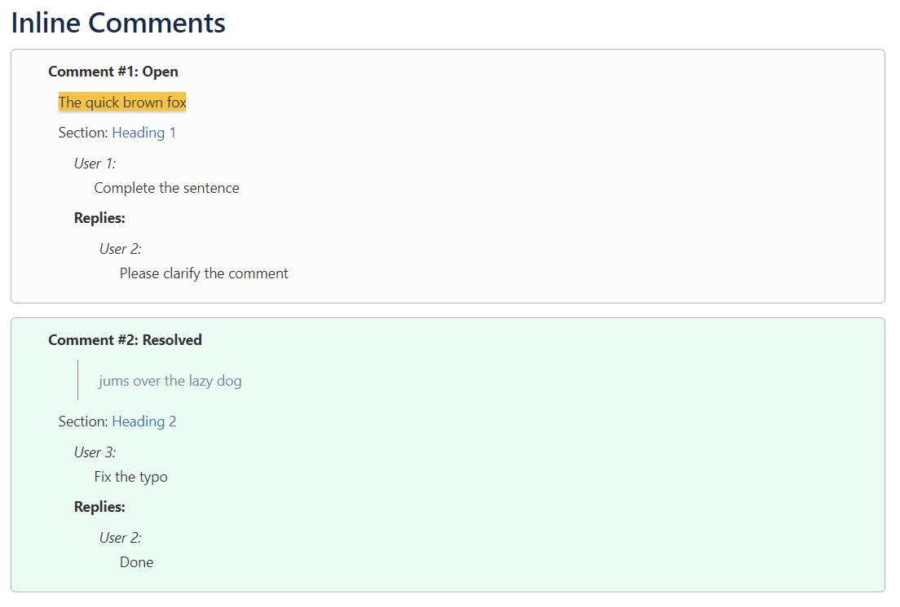

# Confluence Inline Comments Extractor

## About

Getting a list of inline comments and the replies in confluence pages is a tedious and manual process. This repo offers multiple bookmarklets that execute javascript on your browser to extract the comments and give you the list at the end of the page.

### Notes

  1. This script was developed and tested only on Chrome browser. It may or may not work on other browsers.

  2. The list of comments is added only at your browser's end and it does not update in the confluence page itself. So refreshing the page clears this list.

  3. Only inline comments are processed by these bookmarklets. The regular comments that are added at the bottom of the page are excluded.

## Installation

1. Ensure that you have **Bookmarks bar** enabled in your browser and is visible. On Chrome `Ctrl + Shift + B` will toggle the visibility of the bookmarks bar.

2. Go to the [Bookmarklets](#bookmarklets) section and choose which bookmarklet you need. Click on the link and then follow the instructions given there - **drag & drop** the bookmarklet to your bookmarks bar.

## Bookmarklets

1. [Confluence Comments - List View](html/confluence-comments-extractor-list.html)

   This produces a list of comments and their replies as shown in the image below. To install this bookmarklet, click on the above link.

   ### Figure 1. Confluence Comments - List View

   

2. [Confluence Comments - Table View](html/confluence-comments-extractor-table.html)

   This produces a table of comments as shown in the image below. To install this bookmarklet, click on the above link.

   ### Figure 2. Confluence Comments - Table View

   

## Usage

After the one-time installation of the bookmarklet, you can use it anytime.

Open the confluence page from which you want the comments and then simply click on the added bookmarklet from the bookmarks bar. The javascript will take some run to execute (Approx. speed: *0.5 seconds per comment*). Once the exeution is complete, you'll see a browser alert indicating the completion of the script. You can scroll to the end of the confluence page to get the output.

In case of the table view, the table is pre-selected, so that you can copy (`Ctrl + C`) and use it in your application.

## Scripts

The bookmarklets are based on javascripts. The scripts for the above bookmarlets can be found in the [/bookmarklets](https://github.com/cy-shriram/confluence-inline-comments/blob/master/bookmarklets/) directory of this repo.

## Contributing

First off, thanks for taking the time to contribute! Contributions are what make the open-source community such an amazing place to learn, inspire, and create. Any contributions you make will benefit everybody else and are **greatly appreciated**.

Please try to create bug reports that are:

- _Reproducible._ Include steps to reproduce the problem.
- _Specific._ Include as much detail as possible: which version, what environment, etc.
- _Unique._ Do not duplicate existing opened issues.
- _Scoped to a Single Bug._ One bug per report.

## License

This project is licensed under the **MIT license**. Feel free to edit and distribute this template as you like.

See [LICENSE](https://github.com/cy-shriram/confluence-inline-comments/blob/master/LICENSE) for more information.
